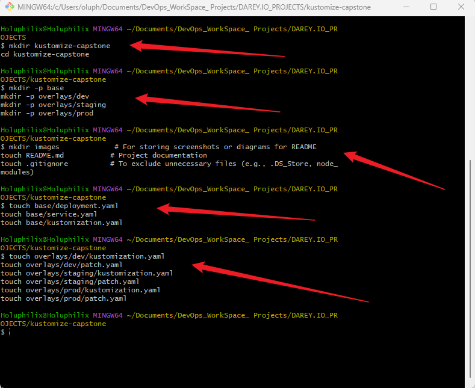
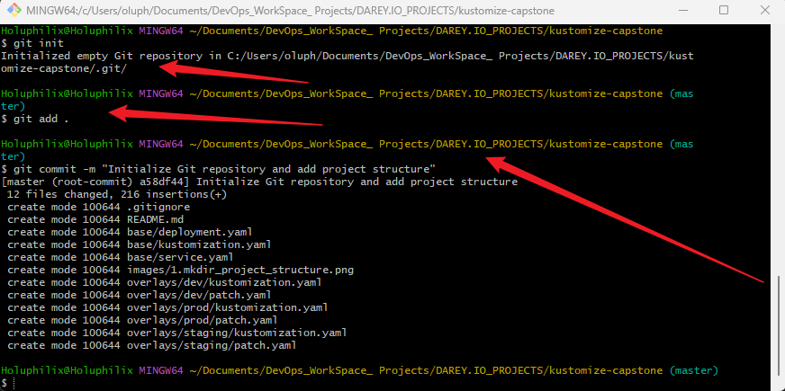
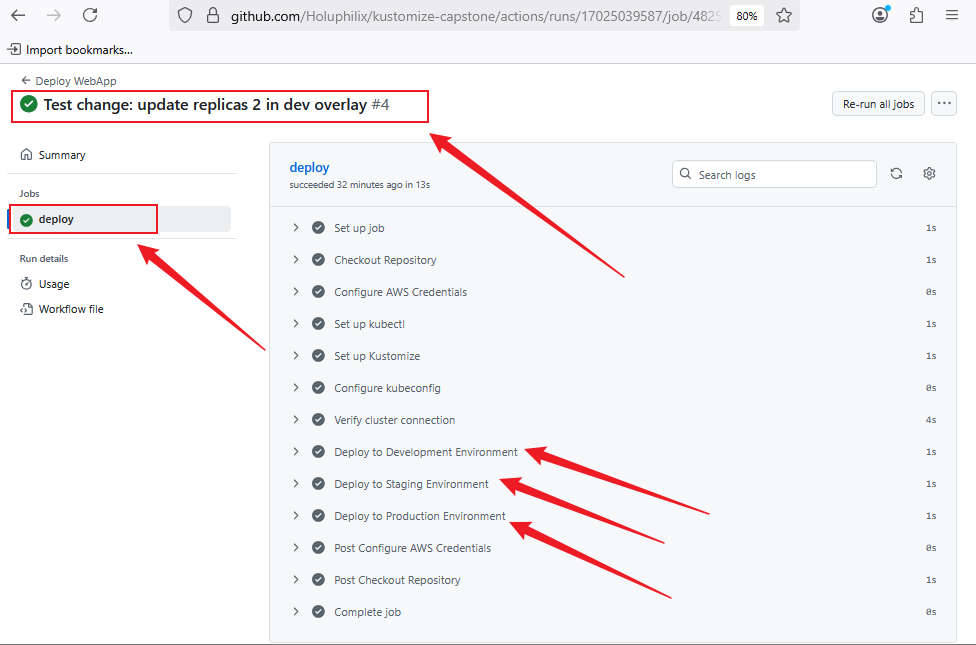
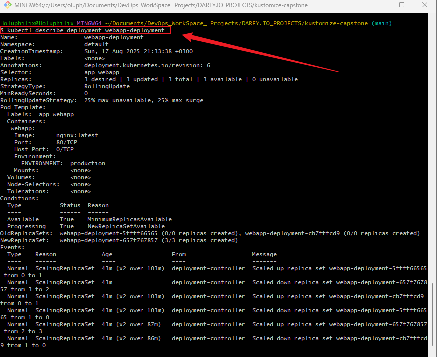
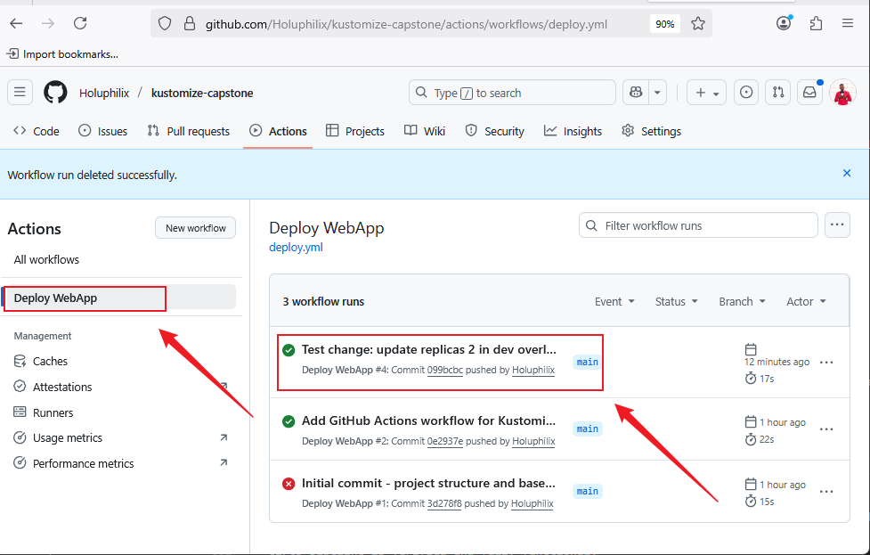
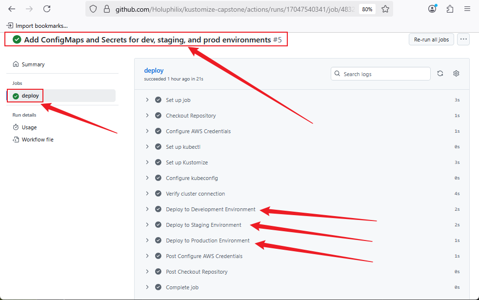

# **Implementing a Multi-Environment Application Deployment with Kustomize**

## **Project Overview**

This project focuses on deploying a web application across multiple environments: **development, staging, and production**, using **Kustomize**. It emphasizes efficient configuration management, environment-specific customization, and seamless integration with a **CI/CD pipeline**, showcasing practical expertise in **Kubernetes deployment practices**.


## **Why This Project Is Relevant**

Managing Kubernetes configurations across multiple environments can quickly become complex and error-prone. This project teaches how to leverage Kustomize to maintain clear, reusable, and environment-specific configurations while ensuring smooth deployment through automated CI/CD pipelines.

## **Project Goals and Objectives**

* Learn how to structure and manage Kubernetes resources using Kustomize.
* Implement environment-specific overlays for development, staging, and production.
* Integrate Kustomize into a CI/CD workflow to automate deployments.
* Handle sensitive data securely using ConfigMaps and Secrets.
* Demonstrate advanced Kustomize features like transformers and generators.

## **Prerequisites**

* Basic knowledge of Kubernetes concepts (Deployments, Services, ConfigMaps, Secrets).
* Familiarity with Git version control.
* Understanding of CI/CD pipelines (GitHub Actions, Jenkins, or similar).
* Basic command-line and YAML configuration skills.

## **Project Deliverables**

* A structured Kustomize project repository with base and overlay configurations.
* A CI/CD pipeline integrated with Kustomize deployments.
* Properly documented `README.md` explaining project setup and deployment steps.
* Use of ConfigMaps and Secrets for secure configuration management.

## **Tools & Technologies Used**

* Kubernetes
* Kustomize
* Git
* CI/CD platform (GitHub Actions or Jenkins)
* YAML configuration files

## **Project Components**

* **Base Directory:** Contains the core Kubernetes resources for the web application.
* **Overlays Directory:** Contains environment-specific configurations (`dev`, `staging`, `prod`).
* **CI/CD Pipeline:** Automates deployment of the application when changes occur.
* **Secrets & ConfigMaps:** Manages sensitive and environment-specific configuration data.
* **Documentation:** Clear instructions and explanations in `README.md`.

Perfect! We can update **Task 1** to include the `patch.yaml` files in each overlay environment. Here’s the revised version:

### **Task 1 : Set Up Your Project Directory and Structure (Complete)**

**Objective:** Create the foundational project structure with all necessary directories and starter files for a Kustomize-based multi-environment deployment project, including overlay patches.

**Steps:**

1. Create the main project directory:

```bash
mkdir kustomize-capstone
cd kustomize-capstone
```

2. Create core subdirectories for Kustomize:

```bash
mkdir -p base
mkdir -p overlays/dev
mkdir -p overlays/staging
mkdir -p overlays/prod
```

3. Create supporting directories and files:

```bash
mkdir images             # For storing screenshots or diagrams for README
touch README.md           # Project documentation
touch .gitignore          # To exclude unnecessary files (e.g., .DS_Store, node_modules)
```

4. Create starter files inside `base/` (can be empty initially):

```bash
touch base/deployment.yaml
touch base/service.yaml
touch base/kustomization.yaml
```

5. Create starter files for overlays, including patch files:

```bash
touch overlays/dev/kustomization.yaml
touch overlays/dev/patch.yaml
touch overlays/staging/kustomization.yaml
touch overlays/staging/patch.yaml
touch overlays/prod/kustomization.yaml
touch overlays/prod/patch.yaml
```

### **Project Directory Structure After Task 1**

```
kustomize-capstone/
├── base/
│   ├── deployment.yaml
│   ├── service.yaml
│   └── kustomization.yaml
├── overlays/
│   ├── dev/
│   │   ├── kustomization.yaml
│   │   └── patch.yaml
│   ├── staging/
│   │   ├── kustomization.yaml
│   │   └── patch.yaml
│   └── prod/
│       ├── kustomization.yaml
│       └── patch.yaml
├── images/
├── README.md
└── .gitignore
```

**Outcome:**

**Screenshot:** Create Project Directories and Files

* Project directory fully structured for Kustomize deployment across `dev`, `staging`, and `prod` environments.
* Overlay directories now include both `kustomization.yaml` and `patch.yaml` for environment-specific customizations.
* Supporting files for documentation and visuals are ready.

## **Task 2 : Initialize Git Repository**

**Objective:** Set up version control for your project to track changes, maintain history, and prepare for future integration with a remote repository and CI/CD pipelines.

### **Steps:**

1. **Initialize Git in your project directory**
   Navigate to your project root and initialize Git:

```bash
cd kustomize-capstone
git init
```

This creates a new local Git repository.

2. **Update `.gitignore`**
   Add files and directories that should be ignored by Git. This helps prevent committing unnecessary or sensitive files. Sample `.gitignore` for this project:

```gitignore
# OS files
.DS_Store
Thumbs.db

# Kustomize build artifacts
*.yaml.bak
*.tmp

# Kubernetes temporary files
*.kube*

# IDE and editor folders
.vscode/
.idea/

# Node dependencies (if any)
node_modules/
```

3. **Stage all files for initial commit**

```bash
git add .
```

4. **Commit the project structure**

```bash
git commit -m "Initialize Git repository and add project structure"
```

This records your current project state in Git locally.

5. **Optional: Connect to a remote repository (GitHub, GitLab, etc.)**
   Since your project is fresh, you can skip this for now. When ready, add the remote and push:

```bash
git remote add origin https://github.com/Holuphilix/kustomize-capstone.git
git branch -M main
git push -u origin main
```

### **Outcome:**

**Screenshot:** Initialize Git Repository


* Git is initialized and tracking all project files locally.
* `.gitignore` ensures unnecessary or temporary files are not committed.
* Initial commit preserves the project structure and starter files.
* The project is ready for future changes, CI/CD integration, and eventual push to a remote repository.

## **Task 3 : Define Base Configuration**

**Objective:**
Create the core Kubernetes resources for your web application in the `base/` directory. These resources serve as the foundation for all environment-specific overlays.

### Steps

#### 1. Create the Deployment resource (`base/deployment.yaml`)

```yaml
apiVersion: apps/v1
kind: Deployment
metadata:
  name: webapp-deployment
spec:
  replicas: 2
  selector:
    matchLabels:
      app: webapp
  template:
    metadata:
      labels:
        app: webapp
    spec:
      containers:
        - name: webapp
          image: nginx:latest
          ports:
            - containerPort: 80
```

#### 2. Create the Service resource (`base/service.yaml`)

```yaml
apiVersion: v1
kind: Service
metadata:
  name: webapp-service
spec:
  selector:
    app: webapp
  ports:
    - protocol: TCP
      port: 80
      targetPort: 80
  type: ClusterIP
```

#### 3. Create the Base `kustomization.yaml` (`base/kustomization.yaml`)

```yaml
apiVersion: kustomize.config.k8s.io/v1beta1
kind: Kustomization
resources:
  - deployment.yaml
  - service.yaml
```

### Outcome

* `base/` contains the core Kubernetes resources for your web application.
* `deployment.yaml` defines the application pods and replicas.
* `service.yaml` exposes the application internally in the cluster.
* `kustomization.yaml` manages these resources and prepares them for environment-specific overlays.

## **Task 4 : Create Environment-Specific Overlays**

**Objective:**
Customize the base configuration for each environment (`dev`, `staging`, `prod`) by using overlays and patch files. This allows environment-specific variations like replica counts, resource limits, or environment variables.

### Steps

#### 1. Development Overlay (`overlays/dev/`)

**`kustomization.yaml`**

```yaml
apiVersion: kustomize.config.k8s.io/v1beta1
kind: Kustomization
resources:
  - ../../base
patchesStrategicMerge:
  - patch.yaml
```

**`patch.yaml`**

```yaml
apiVersion: apps/v1
kind: Deployment
metadata:
  name: webapp-deployment
spec:
  replicas: 1
  template:
    spec:
      containers:
        - name: webapp
          env:
            - name: ENVIRONMENT
              value: "development"
```

#### 2. Staging Overlay (`overlays/staging/`)

**`kustomization.yaml`**

```yaml
apiVersion: kustomize.config.k8s.io/v1beta1
kind: Kustomization
resources:
  - ../../base
patchesStrategicMerge:
  - patch.yaml
```

**`patch.yaml`**

```yaml
apiVersion: apps/v1
kind: Deployment
metadata:
  name: webapp-deployment
spec:
  replicas: 2
  template:
    spec:
      containers:
        - name: webapp
          env:
            - name: ENVIRONMENT
              value: "staging"
```

#### 3. Production Overlay (`overlays/prod/`)

**`kustomization.yaml`**

```yaml
apiVersion: kustomize.config.k8s.io/v1beta1
kind: Kustomization
resources:
  - ../../base
patchesStrategicMerge:
  - patch.yaml
```

**`patch.yaml`**

```yaml
apiVersion: apps/v1
kind: Deployment
metadata:
  name: webapp-deployment
spec:
  replicas: 3
  template:
    spec:
      containers:
        - name: webapp
          env:
            - name: ENVIRONMENT
              value: "production"
```

### Outcome

* Each overlay (`dev`, `staging`, `prod`) customizes the base deployment according to environment-specific needs.
* Replicas and environment variables are set per environment.
* Overlays are ready for integration with CI/CD pipelines in the next tasks.

## **Task 5 : Integrate with a CI/CD Pipeline**

**Objective:**
Set up a CI/CD pipeline using **GitHub Actions** to automatically deploy the web application to a Kubernetes cluster on **Amazon EKS**. The pipeline will leverage Kustomize overlays for development, staging, and production environments. Authentication will be handled using AWS credentials and a base64-encoded kubeconfig secret (`KUBECONFIG_DATA`).

### **Steps:**

1. **Create an EKS Cluster with `eksctl`**

   ```bash
   eksctl create cluster \
     --name my-kustomize-cluster \
     --region us-east-1 \
     --nodegroup-name standard-workers \
     --node-type t3.medium \
     --nodes 2
   ```

   * `--name`: Name of the EKS cluster
   * `--region`: AWS region where the cluster is created
   * `--nodegroup-name`: Worker node group identifier
   * `--node-type`: EC2 instance type for worker nodes
   * `--nodes`: Number of worker nodes to provision

2. **Configure `kubectl` to Connect to the Cluster**

   ```bash
   aws eks update-kubeconfig \
     --name my-kustomize-cluster \
     --region us-east-1
   ```

   Verify connectivity:

   ```bash
   kubectl get nodes
   ```

**Screenshot:**    kubectl get nodes


3. **Prepare kubeconfig for GitHub Actions**

   Encode your kubeconfig in base64:

   ```bash
   cat ~/.kube/config | base64 -w 0
   ```

   Copy the output (it will be stored as `KUBECONFIG_DATA` in GitHub Secrets).

4. **Prepare AWS Credentials for GitHub Actions**

   Create an IAM user with programmatic access and assign policies:

   * `AmazonEKSClusterPolicy`
   * `AmazonEKSWorkerNodePolicy`
   * `AmazonEC2FullAccess`
   * `AmazonEKS_CNI_Policy`

   In your GitHub repo → **Settings → Secrets and Variables → Actions → New repository secret**, add:

   * `AWS_ACCESS_KEY_ID`
   * `AWS_SECRET_ACCESS_KEY`
   * `AWS_REGION` → `us-east-1`

5. **Push Project to GitHub**

   ```bash
   git init
   git add .
   git commit -m "Initial commit - project structure and base manifests"
   git remote add origin https://github.com/Holuphilix/kustomize-capstone.git
   git branch -M main
   git push -u origin main
   ```

6. **Add kubeconfig as a Secret in GitHub**

   * Go to **Settings → Secrets and variables → Actions**
   * Click **New repository secret**
   * Name it: `KUBECONFIG_DATA`
   * Paste the base64 output from step 3

7. **Create GitHub Actions Workflow**

   ```bash
   mkdir -p .github/workflows
   touch .github/workflows/deploy.yml
   ```

   `deploy.yml` (updated to use `KUBECONFIG_DATA`):

    ```yaml
    name: Deploy WebApp

    on:
    push:
        branches:
        - main

    jobs:
    deploy:
        runs-on: ubuntu-latest

    steps:
      # Step 1: Checkout repository
      - name: Checkout Repository
        uses: actions/checkout@v3

      # Step 2: Configure AWS credentials
      - name: Configure AWS Credentials
        uses: aws-actions/configure-aws-credentials@v4
        with:
          aws-access-key-id: ${{ secrets.AWS_ACCESS_KEY_ID }}
          aws-secret-access-key: ${{ secrets.AWS_SECRET_ACCESS_KEY }}
          aws-region: ${{ secrets.AWS_REGION }}

      # Step 3: Set up kubectl
      - name: Set up kubectl
        uses: azure/setup-kubectl@v3
        with:
          version: latest

      # Step 4: Set up Kustomize
      - name: Set up Kustomize
        uses: imranismail/setup-kustomize@v1
        with:
          kustomize-version: 5.7.1

      # Step 5: Configure kubeconfig from GitHub Secret
      - name: Configure kubeconfig
        env:
          KUBECONFIG_DATA: ${{ secrets.KUBECONFIG_DATA }}
        run: |
          mkdir -p $HOME/.kube
          echo "$KUBECONFIG_DATA" | base64 --decode > $HOME/.kube/config

      # Step 6: Verify cluster connection
      - name: Verify cluster connection
        run: kubectl get nodes

      # Step 7: Deploy to Development overlay
      - name: Deploy to Development Environment
        run: kubectl apply -k overlays/dev

      # Step 8: Deploy to Staging overlay
      - name: Deploy to Staging Environment
        run: kubectl apply -k overlays/staging

      # Step 9: Deploy to Production overlay
      - name: Deploy to Production Environment
        run: kubectl apply -k overlays/prod
     ```

### **Outcome:**

* An EKS cluster is provisioned and accessible via `kubectl`.
* AWS credentials and kubeconfig are securely stored as GitHub Secrets.
* GitHub Actions deploys the app to **dev, staging, and prod** environments using Kustomize overlays.
* The pipeline triggers on every push to the `main` branch.

## **Task 6 : Test the CI/CD Pipeline**

**Objective:**
Verify that your GitHub Actions workflow correctly deploys the application to **all three Kubernetes environments** using Kustomize overlays.

### **Steps:**

1. **Make a Change in Kustomize Configuration**
   Open one of your overlay directories (for example `overlays/dev/patch.yaml`) and introduce a small change for testing, such as updating the number of replicas:

```yaml
spec:
  replicas: 2
```

Save the file.

2. **Stage and Commit the Changes**

```bash
git add overlays/dev/patch.yaml
git commit -m "Test change: update replicas to 2 in dev overlay"
```

3. **Push Changes to GitHub**
   Since your workflow runs on a **single branch (`main`)**, push all changes there:

```bash
git push origin main
```

4. **Monitor GitHub Actions Workflow**

   * Go to your repository on GitHub → **Actions** tab.
   * Locate the workflow run triggered by your push.
   * Verify that:

     1. The workflow triggered successfully.
     2. AWS credentials and `KUBECONFIG_DATA` were used to authenticate.
     3. All three overlays (`overlays/dev`, `overlays/staging`, `overlays/prod`) were applied sequentially.

**Screenshot Example:** GitHub Actions Test Run


5. **Verify Deployment on EKS Cluster**

```bash
kubectl get nodes
kubectl get deployments -n default
```

**Screenshot:** kubectl get nodes & deployment


```bash
kubectl describe deployment webapp-deployment
```

**Screenshot:** kubectl describe deployment webapp-deployment


Check that your change (e.g., updated replicas) has been applied.

6. **Optional Verification for Staging and Production**

   * Make similar test changes in `overlays/staging/patch.yaml` or `overlays/prod/patch.yaml`.
   * Push to `main`. The workflow will automatically apply the corresponding overlays.

### **Outcome:**

**Screenshot Example:** GitHub Actions Test Run


* The workflow successfully applies Kustomize overlays to **development, staging, and production**.
* Changes pushed to `main` are automatically deployed across all environments.
* CI/CD pipeline is verified and fully functional.

## **Task 7 : Manage Secrets and ConfigMaps**

**Objective:**
Use Kustomize to generate **ConfigMaps** and **Secrets**. Ensure sensitive data is handled securely and applied correctly for each environment.

### **Steps:**

1. **Create ConfigMap for Environment-Specific Variables**
   Create a file `configmap.yaml` in `overlays/dev/`:

   ```yaml
   apiVersion: v1
   kind: ConfigMap
   metadata:
     name: webapp-config
   data:
     LOG_LEVEL: "DEBUG"
     FEATURE_FLAG: "true"
   ```

2. **Create Secret for Sensitive Data**
   Create a file `secret.yaml` in `overlays/dev/`:

   ```yaml
   apiVersion: v1
   kind: Secret
   metadata:
     name: webapp-secret
   type: Opaque
   stringData:
     DB_PASSWORD: "devPassword123"
     API_KEY: "devApiKey456"
   ```

   > **Note:** `stringData` allows plain text input; Kubernetes will encode it automatically.

3. **Reference ConfigMap and Secret in Deployment**
   Update `overlays/dev/kustomization.yaml` to include these resources:

   ```yaml
   apiVersion: kustomize.config.k8s.io/v1beta1
   kind: Kustomization

   resources:
     - ../../base
     - configmap.yaml
     - secret.yaml

   patches:
     - path: patch.yaml
       target:
         kind: Deployment
         name: webapp-deployment
   ```

   Update the container spec in **base/deployment.yaml** to consume them:

   ```yaml
   envFrom:
     - configMapRef:
         name: webapp-config
     - secretRef:
         name: webapp-secret
   ```

4. **Repeat for Staging and Production**

   * Create `configmap.yaml` and `secret.yaml` in `overlays/staging/` and `overlays/prod/` with environment-specific values.

   **staging/configmap.yaml**

   ```yaml
   apiVersion: v1
   kind: ConfigMap
   metadata:
     name: webapp-config
   data:
     LOG_LEVEL: "INFO"
     FEATURE_FLAG: "false"
   ```

   **staging/secret.yaml**

   ```yaml
   apiVersion: v1
   kind: Secret
   metadata:
     name: webapp-secret
   type: Opaque
   stringData:
     DB_PASSWORD: "stagingPassword456"
     API_KEY: "stagingApiKey789"
   ```

   **staging/kustomization.yaml**

   ```yaml
   apiVersion: kustomize.config.k8s.io/v1beta1
   kind: Kustomization

   resources:
     - ../../base
     - configmap.yaml
     - secret.yaml

   patches:
     - path: patch.yaml
       target:
         kind: Deployment
         name: webapp-deployment
   ```

   **prod/configmap.yaml**

   ```yaml
   apiVersion: v1
   kind: ConfigMap
   metadata:
     name: webapp-config
   data:
     LOG_LEVEL: "ERROR"
     FEATURE_FLAG: "false"
   ```

   **prod/secret.yaml**

   ```yaml
   apiVersion: v1
   kind: Secret
   metadata:
     name: webapp-secret
   type: Opaque
   stringData:
     DB_PASSWORD: "prodPassword789"
     API_KEY: "prodApiKey101"
   ```

   **prod/kustomization.yaml**

   ```yaml
   apiVersion: kustomize.config.k8s.io/v1beta1
   kind: Kustomization

   resources:
     - ../../base
     - configmap.yaml
     - secret.yaml

   patches:
     - path: patch.yaml
       target:
         kind: Deployment
         name: webapp-deployment
   ```

5. **Apply Changes Locally**
   To verify configuration per environment:

   ```bash
   kubectl apply -k overlays/dev
   kubectl apply -k overlays/staging
   kubectl apply -k overlays/prod
   ```

**Screenshot:** Verify configuration per environment


6. **Push Updates to GitHub**
   Stage, commit, and push all changes:

   ```bash
   git add .
   git commit -m "Add ConfigMaps and Secrets for dev, staging, and prod environments"
   git push origin main
   ```

7. **Test CI/CD Integration**

   * Verify GitHub Actions automatically deploys the updated ConfigMaps and Secrets.

   **Screenshot:** GitHub Actions Test Run


   * Check resources in the cluster:

   ```bash
   kubectl describe deployment webapp-deployment
   kubectl get configmap
   kubectl get secret
   ```

**Screenshot:** Check resources in the cluster


### **Outcome:**

* Each environment has its own **ConfigMap** and **Secret** managed via Kustomize.
* Sensitive information is stored securely and applied **only** to the intended environment.
* CI/CD workflow automatically deploys these updates across **dev, staging, and production**.

## **Task 8: Implement Transformers and Generators**

**Objective:**
Use advanced Kustomize features such as **transformers** and **generators** to refine your Kubernetes configurations. Apply common labels, annotations, and dynamically generate ConfigMaps or Secrets across multiple environments.

### **Final Updated Project Structure Overview**

```
kustomize-capstone/
├── base/
│   ├── deployment.yaml
│   ├── service.yaml
│   ├── kustomization.yaml
│   ├── labels-transformer.yaml
├── overlays/
│   ├── dev/
│   │   ├── kustomization.yaml
│   │   ├── patch.yaml
│   │   ├── configmap.yaml
│   │   └── secret.yaml
│   ├── staging/
│   │   ├── kustomization.yaml
│   │   ├── patch.yaml
│   │   ├── configmap.yaml
│   │   └── secret.yaml
│   └── prod/
│       ├── kustomization.yaml
│       ├── patch.yaml
│       ├── configmap.yaml
│       └── secret.yaml
├── images/
│   └── (place screenshots and diagrams here)
├── .github/
│   └── workflows/
│       └── deploy.yml
├── .gitignore
└── README.md
```

### **Steps:**

1. **Create a Common Labels Transformer**
   In `base/labels-transformer.yaml`:

```yaml
apiVersion: builtin
kind: LabelTransformer
metadata:
  name: labels-transformer
labels:
  app: webapp
  owner: Holuphilix
fieldSpecs:
  - path: metadata/labels
    kind: Deployment
  - path: metadata/labels
    kind: Service
```

2. **Reference the Transformer in Base**
   In `base/kustomization.yaml`:

```yaml
resources:
  - deployment.yaml
  - service.yaml

transformers:
  - labels-transformer.yaml
```

3. **Create Secret and ConfigMap Generators for Dev**
   In `overlays/dev/kustomization.yaml`:

```yaml
apiVersion: kustomize.config.k8s.io/v1beta1
kind: Kustomization
resources:
  - ../../base
  - configmap.yaml
  - secret.yaml
patches:
  - path: patch.yaml
    target:
      kind: Deployment
      name: webapp-deployment

configMapGenerator:
  - name: dev-config
    literals:
      - LOG_LEVEL=DEBUG
      - FEATURE_FLAG=true

secretGenerator:
  - name: dev-secret
    literals:
      - DB_PASSWORD=devPassword123
      - API_KEY=devApiKey456

generatorOptions:
  disableNameSuffixHash: true
```

4. **Repeat for Staging**
   In `overlays/staging/kustomization.yaml`:

```yaml
apiVersion: kustomize.config.k8s.io/v1beta1
kind: Kustomization

resources:
  - ../../base
  - configmap.yaml
  - secret.yaml

patches:
  - path: patch.yaml
    target:
      kind: Deployment
      name: webapp-deployment

configMapGenerator:
  - name: staging-config
    literals:
      - LOG_LEVEL=INFO
      - FEATURE_FLAG=false

secretGenerator:
  - name: staging-secret
    literals:
      - DB_PASSWORD=stagingPassword456
      - API_KEY=stagingApiKey789

generatorOptions:
  disableNameSuffixHash: true
```

5. **Repeat for Production**
   In `overlays/prod/kustomization.yaml`:

```yaml
apiVersion: kustomize.config.k8s.io/v1beta1
kind: Kustomization

resources:
  - ../../base
  - configmap.yaml
  - secret.yaml

patches:
  - path: patch.yaml
    target:
      kind: Deployment
      name: webapp-deployment

configMapGenerator:
  - name: prod-config
    literals:
      - LOG_LEVEL=ERROR
      - FEATURE_FLAG=false

secretGenerator:
  - name: prod-secret
    literals:
      - DB_PASSWORD=prodPassword789
      - API_KEY=prodApiKey101

generatorOptions:
  disableNameSuffixHash: true
```

6. **Apply Changes to Verify Locally**

```bash
kubectl apply -k overlays/dev
kubectl apply -k overlays/staging
kubectl apply -k overlays/prod
```
**Screenshot:** kubectl apply -k overlays


7. **Check Resources in the Cluster**

```bash
kubectl get configmap
kubectl get secret
```
**Screenshot:** kubectl get configmap & secret


```bash
kubectl describe deployment webapp-deployment
```

**Screenshot:** kubectl describe deployment webapp-deployment


### **Outcome:**

* Common labels and annotations are applied automatically across all resources using **LabelTransformer**.
* Environment-specific **ConfigMaps** and **Secrets** are generated dynamically via **Generators**.
* CI/CD workflow deploys all overlays with the correct configuration.
* This demonstrates advanced Kustomize capabilities in a multi-environment deployment.


### **Implementation Strategy:**

* Used **Kustomize SecretGenerator** and **ConfigMapGenerator** in `kustomization.yaml` instead of creating `secret.yaml` and `configmap.yaml` files manually.
* Applied the **DRY principle**: one base config, three overlays (`dev`, `staging`, `prod`) that override only what changes (values).
* Confirmed that **Secrets** are base64-encoded and securely managed, while **ConfigMaps** store non-sensitive environment variables.
* Ensured Deployments reference the generated ConfigMaps and Secrets correctly via `envFrom`.

### **Challenges Faced:**

1. **Confusion on whether to create `secret.yaml`:**

   * At first, it wasn’t clear if we needed `secret.yaml`.
   * Resolved by realizing `secretGenerator` auto-creates them — no manual file required.

2. **Overlay duplication:**

   * Initially thought we had to duplicate all configs for each overlay.
   * Solved by keeping the **base generic** and overriding only what differs (like image tags, env values).

3. **Verification:**

   * Needed to ensure the generator works properly.
   * Confirmed with `kubectl get secrets` and `kubectl describe deployment` to verify the environment variables.

### **Resolution:**

* By relying on **Kustomize generators**, we avoided committing raw secrets.
* Implemented **clear overlay separation** for different environments.
* Verified configs with `kubectl` to ensure correctness.

### **Key Takeaway:**
Using Kustomize generators for ConfigMaps and Secrets simplified configuration management across environments and enforced security best practices by preventing raw secrets from being exposed in Git.

## 🧹 **Task 9 : Clean Up**

After completing your project, you may want to remove all deployed resources and the EKS cluster to avoid unnecessary costs.

### **Steps:**

1. **Delete Environment Resources**

```bash
kubectl delete -k overlays/dev --namespace dev
kubectl delete -k overlays/staging --namespace staging
kubectl delete -k overlays/prod --namespace prod
```

* This removes all Deployments, Services, ConfigMaps, and Secrets from the respective namespaces.

2. **Delete the EKS Cluster**

```bash
eksctl delete cluster --name my-kustomize-cluster --region us-east-1
```

* This deletes the entire EKS cluster including all nodes and associated resources.

### **Outcome:**

* All Kubernetes resources in **dev, staging, and production** environments are removed.
* The EKS cluster is fully deleted, preventing unnecessary cloud costs.

## 🚀 **Push to GitHub Repository**

To finalize and publish this documentation to your GitHub repository, follow these steps:

1. Navigate to your project root directory:

   ```bash
   cd ~/Documents/DevOps_WorkSpace_Projects/DAREY.IO_PROJECTS/kustomize-capstone
   ```

2. Stage all modified and new files:

   ```bash
   git add .
   ```

3. Commit the changes with a clear and descriptive message:

   ```bash
   git commit -m "Added final documentation for Kubernetes Kustomize project"
   ```

4. Push your local commits to the remote GitHub repository:

   ```bash
   git push origin main
   ```

Your documentation and project updates will now be reflected on **GitHub**, making them accessible for collaboration, version tracking, and showcasing your DevOps expertise.

## **Conclusion**

This project successfully demonstrated how **Kustomize simplifies Kubernetes configuration management** by separating reusable base manifests from environment-specific overlays.

Key takeaways:

* **No duplication** of manifests across environments.
* **Secure secrets management** with `secretGenerator`.
* **Scalability**: Easily extendable for new environments.
* **Consistency**: All environments rely on the same base configuration.

This approach is production-ready and aligns with best practices for managing Kubernetes workloads in real-world DevOps pipelines.

## 👨‍💻 **Author**

### **Philip Oluwaseyi Oludolamu**

**Email: [oluphilix@gmail.com](mailto:oluphilix@gmail.com)**

**GitHub: [github.com/Holuphilix](https://github.com/Holuphilix)**

**LinkedIn: [linkedin.com/in/philipoludolamu](https://linkedin.com/in/philipoludolamu)**
